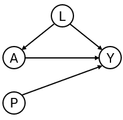

# ipeval: an R package for evaluating predictions under interventions

## Abstract

We present the R package ipeval, which facilitates evaluation of the
predictive performance of models that enable predictions to be generated
under hypothetical intervention settings using observational data. The
package currently supports binary outcomes and time-to-event outcomes
under binary (point) interventions. It implements methods to assess
counterfactual predictive performance using inverse probability of
treatment weighting (IPTW).

## Introduction

Certain prediction models aim to estimate an individual’s risk under
hypothetical intervention scenarios, where intervention can e.g. be a
certain medical treatment but could also be a certain behavioral change
or health policy. These are referred to as
interventional/causal/counterfactual prediction models or models for
prediction under interventions.¹ For example, a model may estimate a
patient’s risk if untreated, if undergoing surgery, or if initiating
medication.^(2–4) Models may also facilitate risk predictions under
several treatment options.⁵

Because such predictions under interventions are often intended to
inform medical decision-making, rigorous validation is essential. In
standard prediction settings, validation involves comparing estimated
risks with observed outcomes in a validation dataset. This approach is
not directly applicable to predictions under interventions in
observational data. Each individual typically receives only one
intervention, and outcomes that they would have had under alternative
interventions remain unobserved. These are referred to as counterfactual
outcomes in causal inference terminology.⁶

When models are used to guide treatment decisions, their performance
must be evaluated under all relevant intervention options for each
individual in the validation data, not only under the interventions that
were actually observed.^(1,7,8) Because clinicians generally assign
treatments based on patient characteristics, treatment groups may not be
comparable due to confounding. Because of this, a model that accurately
estimates the risk of a patient under treatment may not perform well
estimating their counterfactual risk under no treatment, even if the
model also performs well in the group of patients that were actually
untreated.

Evaluating performance of the predictions under only the observed
treatments reflects predictive performance under the historical
treatment assignment mechanism present in the observed data. If such
models are used to inform treatment decisions in new patients, the
treatment assignment mechanism may change, rendering conventional
performance measures less relevant. In fact, a model that performs well
under historical treatment assignment mechanism can lead to harmful
decisions when applied to new patients.⁹

The appropriate target is counterfactual predictive performance: the
agreement between estimated risks under the specific intervention option
of interest and the outcomes that would be observed if all individuals
were assigned that intervention. For example, how well do estimated
risks align with outcomes in a hypothetical scenario where all patients
receive treatment? Despite its importance, a recent review indicates
that this type of validation is rarely conducted.¹⁰ This package
addresses this gap by providing tools to perform such evaluations for
binary and time-to-event outcomes, based on the work of Keogh and Van
Geloven (2024).¹

## Methods

The implementation uses the observed validation data to approximate a
counterfactual dataset representing a population in which all
individuals receive a specified treatment option. This is achieved via
inverse probability of treatment weighting (IPTW). Each individual is
weighted by the inverse of the probability of receiving their observed
treatment conditional on confounders. This reweighting allows
individuals who received a given treatment to represent similar
individuals who did not receive this treatment. Validity of this
approach relies on standard causal assumptions: conditional
exchangeability, consistency, positivity, and correct specification of
the treatment model. More details are given elsewhere.^(1,6,7)

Predictive performance under a given intervention is then evaluated by
comparing estimated risks with observed outcomes in the weighted
(pseudo-)population. The package supports the following performance
metrics: area under the receiver operating characteristic curve (AUC),
Brier score, observed-expected (O/E) ratio, and calibration plots.

## Illustration

Inputs required to the functions in this package include: (1) a
validation data set in which the performance of an interventional
prediction model is to be evaluated, and (2) models from which
predictions can be made under a specified binary intervention for
individuals in the validation data.

To develop the interventional prediction model, we first simulate
development data as in the DAG in Figure 1 for binary treatment $`A`$,
binary outcome $`Y`$, continuous confounder $`L`$ and an additional
predictor $`P`$. Treatment assignment depends on $`L`$, and treatment
has a protective effect on the outcome (if $`A = 1`$ the probability of
$`Y = 1`$ is lower than if $`A = 0`$).



Figure 1

``` r

library(ipeval)

simulate_data <- function(n, seed) {
  set.seed(seed)
  data <- data.frame(id = 1:n)
  data$L <- rnorm(n)
  data$A <- rbinom(n, 1, plogis(2*data$L))
  data$P <- rnorm(n)
  data$Y <- rbinom(n, 1, plogis(0.5 + data$L + 1.25 * data$P - 0.9*data$A))
  data
}

df_dev <- simulate_data(n = 5000, seed = 1)
head(df_dev)
#>   id          L A          P Y
#> 1  1 -0.6264538 0 -0.7948034 0
#> 2  2  0.1836433 0  0.6060846 1
#> 3  3 -0.8356286 0 -1.0624674 0
#> 4  4  1.5952808 1  1.0192005 1
#> 5  5  0.3295078 1  0.1776102 0
#> 6  6 -0.8204684 0 -1.0309747 0
```

Suppose that the aim of our models are for informing whether patients
should receive treatment or not, by providing estimates of what their
risk would be if they were treated and what it would be if they were
untreated. We create two prediction models using the development data,
from which such predictions could be obtained. The ‘naive model’ and the
‘causal model’ both include A and P as predictors for Y.

The naive model ignores confounding by $`L`$.

``` r

# naive model, not accounting for confounding variable L
model_naive <- glm(Y ~ A + P, "binomial", df_dev)
print(coefficients(model_naive))
#> (Intercept)           A           P 
#> -0.07755949  0.26229542  1.15054747
```

The causal model controls for the confounding by L through inverse
probability weights:

``` r

# causal model, accounting for L by IPTW
trt_model <- glm(A ~ L, "binomial", df_dev)
propensity_score <- predict(trt_model, type = "response")
iptw <- 1 / ifelse(df_dev$A == 1, propensity_score, 1 - propensity_score)

model_causal <- glm(Y ~ A + P, "binomial", df_dev, weights = iptw)
print(coefficients(model_causal))
#> (Intercept)           A           P 
#>   0.4936374  -0.7629892   1.1213506
```

The naive and causal models can generate predictions under treatment
(setting $`A`$ to 1) and predictions under no treatment ($`A`$ to 0),
given values of the predictors $`P`$. The estimated coefficient for
$`A`$ of the naive model is positive due to confounding. This arises
because individuals with high values of $`L`$ are more likely to receive
treatment. Although treatment reduces risk, these individuals typically
remain at higher risk than untreated individuals because $`L`$ also
directly increases the outcome risk. As a result, the naive model
captures associations induced by the treatment assignment mechanism
rather than the underlying causal effect. As a consequence, the risk
under treatment is estimated to be higher than under no treatment,
implying that this model would recommend withholding treatment for all
patients.

The causal model correctly infers that treatment benefits patients. Note
that the ‘true’ effect of A was generated within a model that also
conditions on L. Due to non-collapsibility, the estimated coefficient is
not expected to coincide with the effect used in the data-generating
mechanism.

We next assess the performance of both models in an external validation
dataset, which may in general differ in its underlying data-generating
mechanism. In this illustrative example, the validation data are
generated using the same process.

``` r

df_val <- simulate_data(n = 10000, seed = 2)
head(df_val)
#>   id           L A          P Y
#> 1  1 -0.89691455 1 -0.8206868 0
#> 2  2  0.18484918 0  0.1662410 1
#> 3  3  1.58784533 1  0.1747081 0
#> 4  4 -1.13037567 0  1.0416555 0
#> 5  5 -0.08025176 1 -0.1434224 0
#> 6  6  0.13242028 0  1.2078019 1
```

In traditional validation studies, it is common to leave the data as it
is, and compute the performance metrics on this observed dataset, where
some patients were treated and others were not, and treatment assignment
is dependent on confounders.

``` r

observed_score(
  object = list(
    "naive" = model_naive,
    "causal" = model_causal
  ),
  data = df_val,
  outcome = Y,
  metrics = c("auc", "brier", "oeratio")
)
#> 
#>       model   auc brier oeratio
#>  null model 0.500 0.250   1.000
#>       naive 0.764 0.197   0.997
#>      causal 0.739 0.208   0.977
```

Under this evaluation, the naive model appears to outperform the causal
model. However, these performance measures quantify the performance of
the models under the treatment assignment strategy present in the
evaluation data. It quantifies a mixture of performance of the estimated
risk under treatment of patients that were treated, and of performance
of the estimated risk under no treatment of patients that were not
treated. It does not assess the performance of risks under treatment of
patients that were not treated and vice versa. If these models were to
be used for decision-making, the treatment assignment mechanism would
change, and these performance estimates would no longer be relevant.

What we really seek to evaluate is whether both untreated risk and
treated risk are accurate compared to the outcomes all patients would
get if they were to be untreated and treated, respectively. Thus, the
question that we would like to have answered is the following:

How well does our prediction model perform if we were to treat nobody?
And if we were to treat everybody?

The ipeval package aims to provide tools to answer questions like these.
The main function
[`ip_score()`](https://survival-lumc.github.io/ipeval/reference/ip_score.md)
can be used for this. This function estimates several predictive
performance measures in a validation dataset, printing by default the
assumptions required for valid inference.

Comparing the risk under no treatment to the counterfactual outcomes
under no treatment:

``` r

ip_score(
  object = list(
    "naive" = model_naive,
    "causal" = model_causal
  ),
  data = df_val, 
  outcome = Y,
  treatment_formula = A ~ L, 
  treatment_of_interest = 0,
  null_model = FALSE
)
#> Estimation of the performance of the prediction model in a
#>  pseudopopulation where everyone's treatment A was set to 0.
#> The pseudopopulation is constructed from 4941 (49.4%) subjects
#>  ($pseudopop) in data who indeed received treatment level 0. These
#>  subjects are reweighted to represent the full target population under a
#>  hypothetical intervention in which everyone received this treatment
#>  level.
#> The following assumptions must be satisfied for correct inference:
#> 
#> Causal assumptions:
#> 
#> - Conditional exchangeability: after adjustment for the covariates used
#>  to construct the inverse probability of treatment weights (IPTW), i.e.,
#>  {L}, there is no unmeasured confounding for the relation between
#>  treatment and outcome.
#> - Conditional positivity: the probability of receiving treatment level
#>  0 should be greater than zero for each value (combination) of the
#>  variable(s) {L} that is observed in the full population. The
#>  distribution of IPT-weights can be assessed with
#>  $ipt$weights[$pseudopop$ids].
#> - Consistency: the observed outcome under the received treatment level
#>  equals the potential outcome under that treatment level. This includes
#>  the assumption of no interference between subjects.
#> 
#> Modeling assumptions:
#> 
#> - Correctly specified propensity model. Estimated treatment model is
#> logit(A) = 0.01 + 2.01*L. See also $ipt$model.
#> 
#> Performance estimates:
#> 
#>   model   auc brier scaled_brier oeratio
#>   naive 0.755 0.208         12.6    1.25
#>  causal 0.755 0.194         18.8    1.01
```


And, similarly, comparing the risk under treatment to the corresponding
counterfactual outcome (this time not printing the assumptions):

``` r

ip_score(
  object = list(
    "naive" = model_naive,
    "causal" = model_causal
  ),
  data = df_val, 
  outcome = Y,
  treatment_formula = A ~ L, 
  treatment_of_interest = 1,
  null_model = FALSE,
  quiet = TRUE
)
#> 
#>   model  auc brier scaled_brier oeratio
#>   naive 0.76 0.208         15.2   0.806
#>  causal 0.76 0.196         20.3   0.967
```


From these performance metrics it can be seen that for both treatment
options, the causal model outperforms the naive model in predicting the
counterfactual outcome that we would observe if we were to set every
patients treatment to the corresponding treatment.

Other functions of the package include support for stabilized
ipt-weights and bootstrapping for confidence intervals. Survival models
such as Cox models can also be validated on right censored survival
data.

## Discussion

In standard validation, the naive prediction model appeared to perform
better, while the causal model demonstrated superior performance when
evaluated under counterfactual scenarios. Relying solely on standard
validation could lead to the erroneous conclusion that the naive model
is preferable for decision support. According to the naive model, nobody
should receive treatment, as it predicts higher risk under treatment
(setting $`a`$ to 1) than under no treatment (setting a to 0).

This example highlights a fundamental issue: a model that performs well
in predicting observed outcomes may not provide accurate predictions
under alternative, hypothetical treatment strategies. Consequently,
validation based solely on observed data may not reflect the model’s
performance in the intended decision-making context. Counterfactual
validation addresses this limitation by aligning the evaluation with the
decision context. The counterfactual performance assessment indicates
that the causal model is superior to the naive model when used for
treatment decision making.

It should be noted that counterfactual performance estimation remains
dependent on causal assumptions. Violations, such as unmeasured
confounding or model misspecification, may lead to biased
estimates.^(1,6)

## Future directions

Many prediction models intended for decision support are currently not
validated within a counterfactual framework. By providing accessible
implementations of these methods, ipeval aims to facilitate more
appropriate validation practices. Future developments will focus on
extending the package to longitudinal treatment strategies where
time-dependent confounding arises, and to settings involving competing
risks.

## References

1\.

Keogh, R. H. & Van Geloven, N. [Prediction Under Interventions:
Evaluation of Counterfactual Performance Using Longitudinal
Observational Data](https://doi.org/10.1097/EDE.0000000000001713).
*Epidemiology (Cambridge, Mass.)* **35**, 329–339 (2024).

2\.

SCORE2 working group and ESC Cardiovascular risk collaboration. [SCORE2
risk prediction algorithms: New models to estimate 10-year risk of
cardiovascular disease in
Europe](https://doi.org/10.1093/eurheartj/ehab309). *European Heart
Journal* **42**, 2439–2454 (2021).

3\.

Nashef, S. A. M. *et al.* [EuroSCORE
II](https://doi.org/10.1093/ejcts/ezs043). *European Journal of
Cardio-Thoracic Surgery: Official Journal of the European Association
for Cardio-Thoracic Surgery* **41**, 734-744; discussion 744-745 (2012).

4\.

O’Brien, E. C. *et al.* [The ORBIT bleeding score: A simple bedside
score to assess bleeding risk in atrial
fibrillation](https://doi.org/10.1093/eurheartj/ehv476). *European Heart
Journal* **36**, 3258–3264 (2015).

5\.

Hageman, S. H. J. *et al.* [Estimation of recurrent atherosclerotic
cardiovascular event risk in patients with established cardiovascular
disease: The updated SMART2
algorithm](https://doi.org/10.1093/eurheartj/ehac056). *European Heart
Journal* **43**, 1715–1727 (2022).

6\.

Hernan, M. A. & Robins, J. M. *Causal Inference: What If*. (Chapman &
Hall/CRC, Boca Raton, 2020).

7\.

Boyer, C. B., Dahabreh, I. J. & Steingrimsson, J. A. [Estimating and
Evaluating Counterfactual Prediction
Models](https://doi.org/10.1002/sim.70287). *Statistics in Medicine*
**44**, e70287 (2025).

8\.

Pajouheshnia, R., Peelen, L. M., Moons, K. G. M., Reitsma, J. B. &
Groenwold, R. H. H. [Accounting for treatment use when validating a
prognostic model: A simulation
study](https://doi.org/10.1186/s12874-017-0375-8). *BMC Med Res
Methodol* **17**, 103 (2017).

9\.

Amsterdam, W. A. C. van, Geloven, N. van, Krijthe, J. H., Ranganath, R.
& Cinà, G. [When accurate prediction models yield harmful
self-fulfilling
prophecies](https://doi.org/10.1016/j.patter.2025.101229). *Patterns*
**6**, 101229 (2025).

10\.

Lin, L., Sperrin, M., Jenkins, D. A., Martin, G. P. & Peek, N. [A
scoping review of causal methods enabling predictions under hypothetical
interventions](https://doi.org/10.1186/s41512-021-00092-9). *Diagnostic
and Prognostic Research* **5**, 3 (2021).
