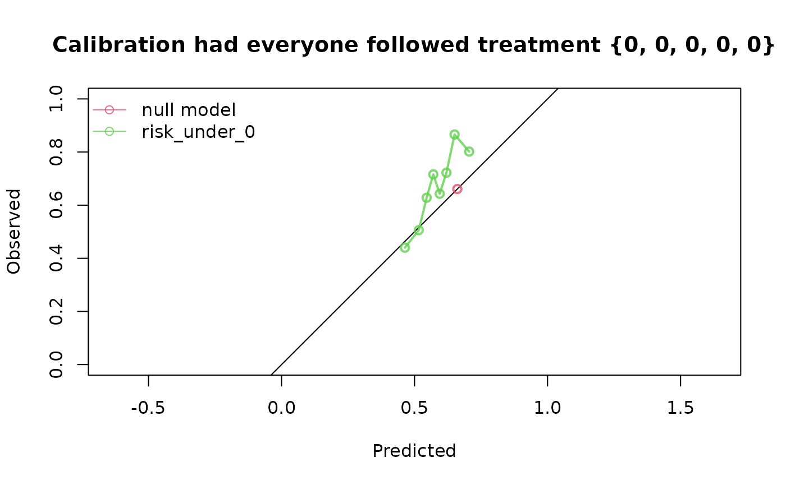

# Evaluating predictions under longitudinal interventions

``` r

library(ipeval)
library(survival)
```

This vignette demonstrates how to evaluate predictions under
longitudinal treatment strategies in the presence of time-dependent
confounding.

For more detail, see [Keogh and Van Geloven
(2024)](https://doi.org/10.1097/EDE.0000000000001713), from which the
methods in this package are implemented.

We assume that an evaluation dataset (df_val) is available, as well as
risk estimates corresponding to one or more treatment strategies.
Throughout this vignette, we use data generated from the causal
structure shown below.


Suppose we have estimated risks under two intervention strategies:

- Never treat: treatment is set to 0 at every visit (risk_under_0).
- Always treat: treatment is set to 1 at every visit (risk_under_1).

In [the previous
vignette](https://survival-lumc.github.io/ipeval/articles/longitudinal-data-and-cox-models.md),
we show how such predictions can be obtained from a marginal structural
Cox model (and how longitidunial data could be simulated). Here, we
focus on evaluating those predictions.

``` r

head(df_val)
#>   id       time status A0 A1 A2 A3 A4          L0         L1         L2
#> 1  1  0.9360867   TRUE  0 NA NA NA NA  1.06341113         NA         NA
#> 2  2  1.2580945   TRUE  1  1 NA NA NA -0.53409488  1.5017784         NA
#> 3  3 12.2457409  FALSE  1  1  0  0  1 -0.07742528 -0.7924851 -1.1835030
#> 4  4  9.1312175   TRUE  1  1  1  1  0  2.55167634  1.2023957 -0.3769435
#> 5  5  2.0438731   TRUE  0  1  1 NA NA  1.26802982  2.2091646  2.1137184
#> 6  6 52.3238041  FALSE  1  1  1  0  0 -0.35876638 -1.3821753 -3.5645645
#>           L3        L4         P
#> 1         NA        NA 0.1680415
#> 2         NA        NA 0.8075164
#> 3 -0.7447095  1.021002 0.3849424
#> 4 -2.4367693 -1.688575 0.3277343
#> 5         NA        NA 0.6021007
#> 6 -5.8922557 -4.522566 0.6043941
summary(risk_under_0)
#>    Min. 1st Qu.  Median    Mean 3rd Qu.    Max. 
#>  0.3261  0.5321  0.5826  0.5832  0.6339  0.8743
summary(risk_under_1)
#>    Min. 1st Qu.  Median    Mean 3rd Qu.    Max. 
#>  0.1391  0.2504  0.2822  0.2854  0.3170  0.5448
```

We will use the
[`ip_score_long()`](https://survival-lumc.github.io/ipeval/reference/ip_score_long.md)
function, which evaluates risk estimates under longitudinal
interventions using inverse-probability weighting. It requires: \* an
outcome dataset with one row per subject, with survival time and status,
\* a dataset in long format, containing data on observed treatment and
covariates, with one row per subject and visit, \* a model describing
the treatment assignment mechanism.

The long dataset must include all variables used in the treatment model.
In our example, treatment is assumed to depend on the value of L at the
current visit and the treatment value at the previous visit, so the
variables L, A, and A_lag_1 are required.

This package provides the convenience functions
[`wide_to_long()`](https://survival-lumc.github.io/ipeval/reference/wide_to_long.md)
and
[`add_lag_terms()`](https://survival-lumc.github.io/ipeval/reference/add_lag_terms.md)
to help reshape your data in this way.

``` r

df_val_outcome <- df_val[, c("id", "time", "status")]
df_val_long <- wide_to_long(df_val, baseline_variables = c("id"), 
                            wide_variables = list("A" = paste0("A", 0:4),
                                                  "L" = paste0("L", 0:4)),
                            visit_times = 0:4, outcome_times = df_val$time)
df_val_long <- add_lag_terms(df_val_long, "A")
head(df_val_long)
#>   id visit_time A           L A_lag_1
#> 1  1          0 0  1.06341113       0
#> 2  2          0 1 -0.53409488       0
#> 3  2          1 1  1.50177843       1
#> 4  3          0 1 -0.07742528       0
#> 5  3          1 1 -0.79248510       1
#> 6  3          2 0 -1.18350299       1
```

We can use the function
[`ip_score_long()`](https://survival-lumc.github.io/ipeval/reference/ip_score_long.md)
to evaluate the predictions under the never-treat strategy as follows:

``` r

ip_score_long(
  predictions = risk_under_0,
  data_outcome = df_val_outcome,
  data_long = df_val_long,
  treatment_formula = A ~ A_lag_1 + L,
  treatment_of_interest = "never",
  visit_times = 0:4, 
  time_horizon = 5
)
#> Estimation of the performance of the prediction model in a
#>  pseudopopulation where everyone's treatment A was set to {0, 0, 0, 0,
#>  0}.
#> The pseudopopulation is constructed from 7049 (14.1%) subjects
#>  ($pseudopop) in data who indeed were compliant to treatment strategy
#>  {0, 0, 0, 0, 0} and remained uncensored till time=5. These subjects are
#>  reweighted to represent the full target population under a hypothetical
#>  intervention in which everyone received this treatment strategy and
#>  remained uncensored till time=5.
#> The following assumptions must be satisfied for correct inference:
#> 
#> Causal assumptions:
#> 
#> - Conditional exchangeability: after adjustment for the covariates used
#>  to construct the inverse probability of treatment weights (IPTW), i.e.,
#>  {A_lag_1, L}, there is no unmeasured confounding for the relation
#>  between treatment and outcome.
#> - Conditional positivity: the probability of receiving treatment
#>  strategy {0, 0, 0, 0, 0} should be greater than zero for each value
#>  (combination) of the variable(s) {A_lag_1, L} that is observed in the
#>  full population. The distribution of IPT-weights can be assessed with
#>  $ipt$weights[$pseudopop$ids].
#> - Consistency: the observed outcome under the received treatment
#>  strategy equals the potential outcome under that treatment strategy.
#>  This includes the assumption of no interference between subjects.
#> - Independent censoring. The censoring mechanism is completely
#>  independent of the outcome process.
#> - Positivity for censoring: requires that the probability of remaining
#>  uncensored till time=5 is greater than zero. The distribution of
#>  IPC-weights can be assessed with $ipc$weights[$pseudopop$ids].
#> 
#> Modeling assumptions:
#> 
#> - Correctly specified propensity model. Estimated treatment model is
#> logit(A) = 0.01 + 0.79*A_lag_1 + 0.5*L. See also $ipt$model.
#> - The censoring distribution was estimated nonparametrically using the
#>  Kaplan-Meier estimator. The probability of remaining uncensored is
#> P(C > 5) = 0.78. See also $ipc$model.
#> 
#> Performance estimates:
#> 
#>         model   auc brier scaled_brier oeratio
#>    null model 0.500 0.224         0.00    1.00
#>  risk_under_0 0.661 0.218         2.87    1.13
```



The same procedure can be used for the always-treated strategy:

``` r

ip_score_long(
  predictions = risk_under_1,
  data_outcome = df_val_outcome,
  data_long = df_val_long,
  treatment_formula = A ~ A_lag_1 + L,
  treatment_of_interest = "always",
  visit_times = 0:4, 
  time_horizon = 5
)
#> Estimation of the performance of the prediction model in a
#>  pseudopopulation where everyone's treatment A was set to {1, 1, 1, 1,
#>  1}.
#> The pseudopopulation is constructed from 5996 (12%) subjects
#>  ($pseudopop) in data who indeed were compliant to treatment strategy
#>  {1, 1, 1, 1, 1} and remained uncensored till time=5. These subjects are
#>  reweighted to represent the full target population under a hypothetical
#>  intervention in which everyone received this treatment strategy and
#>  remained uncensored till time=5.
#> The following assumptions must be satisfied for correct inference:
#> 
#> Causal assumptions:
#> 
#> - Conditional exchangeability: after adjustment for the covariates used
#>  to construct the inverse probability of treatment weights (IPTW), i.e.,
#>  {A_lag_1, L}, there is no unmeasured confounding for the relation
#>  between treatment and outcome.
#> - Conditional positivity: the probability of receiving treatment
#>  strategy {1, 1, 1, 1, 1} should be greater than zero for each value
#>  (combination) of the variable(s) {A_lag_1, L} that is observed in the
#>  full population. The distribution of IPT-weights can be assessed with
#>  $ipt$weights[$pseudopop$ids].
#> - Consistency: the observed outcome under the received treatment
#>  strategy equals the potential outcome under that treatment strategy.
#>  This includes the assumption of no interference between subjects.
#> - Independent censoring. The censoring mechanism is completely
#>  independent of the outcome process.
#> - Positivity for censoring: requires that the probability of remaining
#>  uncensored till time=5 is greater than zero. The distribution of
#>  IPC-weights can be assessed with $ipc$weights[$pseudopop$ids].
#> 
#> Modeling assumptions:
#> 
#> - Correctly specified propensity model. Estimated treatment model is
#> logit(A) = 0.01 + 0.79*A_lag_1 + 0.5*L. See also $ipt$model.
#> - The censoring distribution was estimated nonparametrically using the
#>  Kaplan-Meier estimator. The probability of remaining uncensored is
#> P(C > 5) = 0.78. See also $ipc$model.
#> 
#> Performance estimates:
#> 
#>         model   auc brier scaled_brier oeratio
#>    null model 0.500 0.212         0.00    1.00
#>  risk_under_1 0.604 0.206         2.52    1.07
```


## Other treatment patterns

The treatment strategy does not need to be “always” or “never” treat.
For example, the following strategy specifies treatment at the first two
visits and leaves subsequent treatment unconstrained:

``` r

ip_score_long(
  predictions = risk_under_0,
  data_outcome = df_val_outcome,
  data_long = df_val_long,
  treatment_formula = A ~ A_lag_1 + L,
  treatment_of_interest = c(0, 0, NA, NA, NA),
  visit_times = 0:4, 
  time_horizon = 5,
  metrics = c("auc", "brier", "oeratio")
)
#> Estimation of the performance of the prediction model in a
#>  pseudopopulation where everyone's treatment A was set to {0, 0, *, *,
#>  *}, where * can be any value as would normally be observed.
#> The pseudopopulation is constructed from 12703 (25.4%) subjects
#>  ($pseudopop) in data who indeed were compliant to treatment strategy
#>  {0, 0, *, *, *} and remained uncensored till time=5. These subjects are
#>  reweighted to represent the full target population under a hypothetical
#>  intervention in which everyone received this treatment strategy and
#>  remained uncensored till time=5.
#> The following assumptions must be satisfied for correct inference:
#> 
#> Causal assumptions:
#> 
#> - Conditional exchangeability: after adjustment for the covariates used
#>  to construct the inverse probability of treatment weights (IPTW), i.e.,
#>  {A_lag_1, L}, there is no unmeasured confounding for the relation
#>  between treatment and outcome.
#> - Conditional positivity: the probability of receiving treatment
#>  strategy {0, 0, *, *, *} should be greater than zero for each value
#>  (combination) of the variable(s) {A_lag_1, L} that is observed in the
#>  full population. The distribution of IPT-weights can be assessed with
#>  $ipt$weights[$pseudopop$ids].
#> - Consistency: the observed outcome under the received treatment
#>  strategy equals the potential outcome under that treatment strategy.
#>  This includes the assumption of no interference between subjects.
#> - Independent censoring. The censoring mechanism is completely
#>  independent of the outcome process.
#> - Positivity for censoring: requires that the probability of remaining
#>  uncensored till time=5 is greater than zero. The distribution of
#>  IPC-weights can be assessed with $ipc$weights[$pseudopop$ids].
#> 
#> Modeling assumptions:
#> 
#> - Correctly specified propensity model. Estimated treatment model is
#> logit(A) = 0.01 + 0.79*A_lag_1 + 0.5*L. See also $ipt$model.
#> - The censoring distribution was estimated nonparametrically using the
#>  Kaplan-Meier estimator. The probability of remaining uncensored is
#> P(C > 5) = 0.78. See also $ipc$model.
#> 
#> Performance estimates:
#> 
#>         model   auc brier oeratio
#>    null model 0.500 0.245   1.000
#>  risk_under_0 0.632 0.234   0.979
```

## Censoring dependent on time varying variables

In the previous examples, we did not specify the censoring mechanism. By
default, the censoring mechanism is assumed to be (marginally)
independent and the censoring weights are estimating using Kaplan-Meier.
It is also possible to specify a Cox censoring model where censoring may
depent on (time-varying) covariates. These variables should then be
available as columns in `data_long`. As a demonstration, this can be
achieved as follows:

``` r

ip_score_long(
  predictions = risk_under_1,
  data_outcome = df_val_outcome,
  data_long = df_val_long,
  treatment_formula = A ~ A_lag_1 + L,
  treatment_of_interest = c(1, 1, 1, 1, 1),
  visit_times = 0:4, 
  time_horizon = 5,
  cens_model = "cox",
  cens_formula = ~ A + A_lag_1 + L,
  metrics = c("auc", "brier", "oeratio")
)
#> Estimation of the performance of the prediction model in a
#>  pseudopopulation where everyone's treatment A was set to {1, 1, 1, 1,
#>  1}.
#> The pseudopopulation is constructed from 5996 (12%) subjects
#>  ($pseudopop) in data who indeed were compliant to treatment strategy
#>  {1, 1, 1, 1, 1} and remained uncensored till time=5. These subjects are
#>  reweighted to represent the full target population under a hypothetical
#>  intervention in which everyone received this treatment strategy and
#>  remained uncensored till time=5.
#> The following assumptions must be satisfied for correct inference:
#> 
#> Causal assumptions:
#> 
#> - Conditional exchangeability: after adjustment for the covariates used
#>  to construct the inverse probability of treatment weights (IPTW), i.e.,
#>  {A_lag_1, L}, there is no unmeasured confounding for the relation
#>  between treatment and outcome.
#> - Conditional positivity: the probability of receiving treatment
#>  strategy {1, 1, 1, 1, 1} should be greater than zero for each value
#>  (combination) of the variable(s) {A_lag_1, L} that is observed in the
#>  full population. The distribution of IPT-weights can be assessed with
#>  $ipt$weights[$pseudopop$ids].
#> - Consistency: the observed outcome under the received treatment
#>  strategy equals the potential outcome under that treatment strategy.
#>  This includes the assumption of no interference between subjects.
#> - Conditionally independent censoring: conditional on variables
#>  {ipscore_longcensored, A, A_lag_1, L}, censoring is independent of the
#>  outcome process.
#> - Conditional positivity for censoring: requires that for all observed
#>  combinations of the covariate variables {ipscore_longcensored, A,
#>  A_lag_1, L} the probability of remaining uncensored till time=5 is
#>  greater than zero.  The distribution of IPC-weights can be assessed
#>  with $ipc$weights[$pseudopop$ids].
#> 
#> Modeling assumptions:
#> 
#> - Correctly specified propensity model. Estimated treatment model is
#> logit(A) = 0.01 + 0.79*A_lag_1 + 0.5*L. See also $ipt$model.
#> - Correctly specified censoring model. The estimated censoring model is
#> P(C > t) = C_0(t)^exp(0*A + -0.01*A_lag_1 + 0*L). See also $ipc$model.
#> 
#> Performance estimates:
#> 
#>         model   auc brier oeratio
#>    null model 0.500 0.212    1.00
#>  risk_under_1 0.604 0.206    1.07
```

Note that the coefficients of the censoring model are estimated close to
0. This is expected as we simulated the data assuming a (marginally)
independent censoring process.
