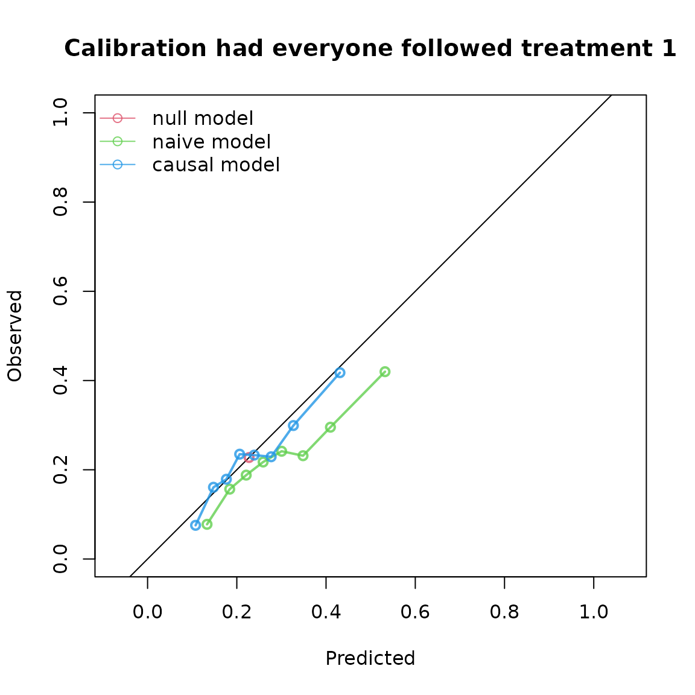
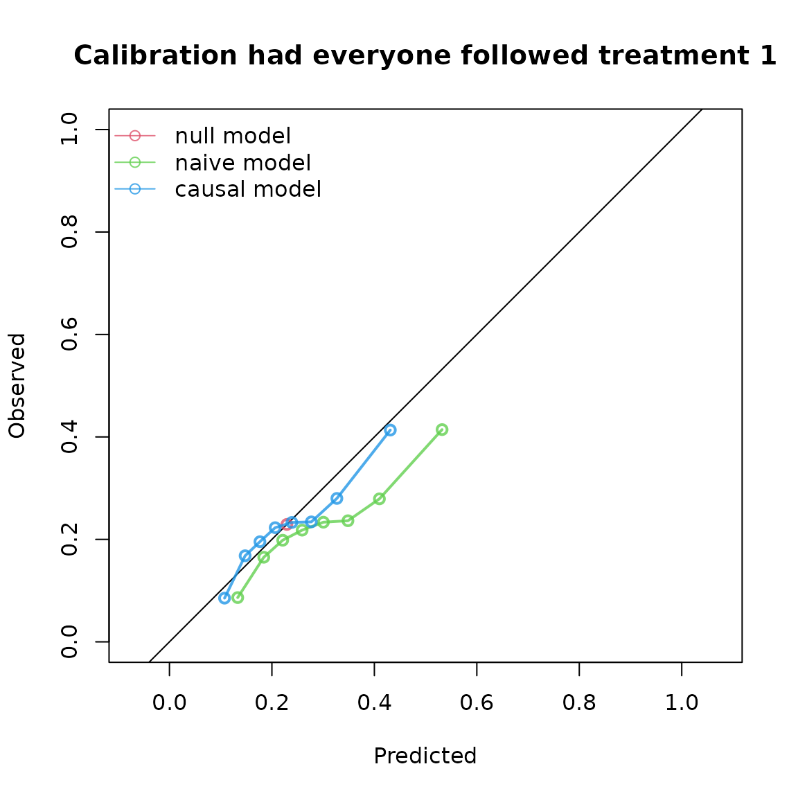
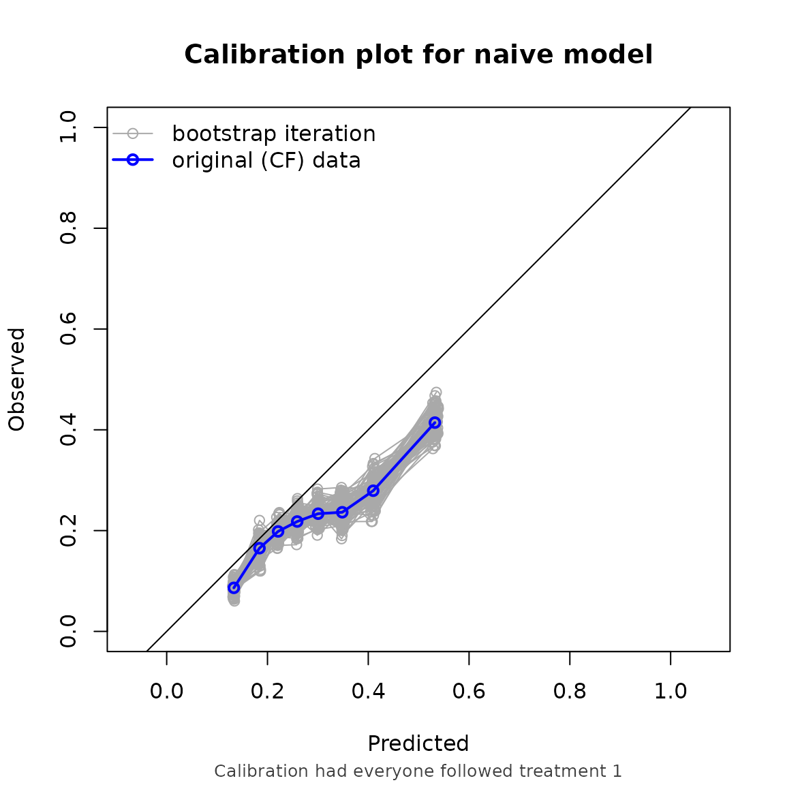
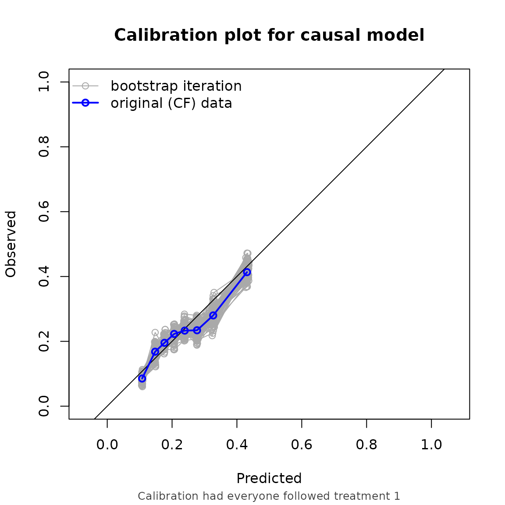

# Evaluating performance in time-to-event data

``` r

library(ipeval)
library(survival)
```

This vignette demonstrates how to estimate counterfactual performance
metrics in right censored survival data.

Just like in the binary outcome, an IP-weighted pseudopopulation is
created which represents a situation in which everybody gets the
treatment level of interest. On top of that, inverse probability of
censoring weights are used such that the pseudopopulation also
represents a situation where nobody gets censored.

## Example 1, non informative censoring

We simulate time-to-event data, where approximately half of patients get
censored. In this example, we use a more complex causal structure, with
two confounders ($`L1`$ and $`L2`$) and two prognostic variables ($`P1`$
and $`P2`$). $`L1`$ and $`P1`$ are standard normal variables, and $`L2`$
and $`P2`$ are binary variables.

``` r

simulate_time_to_event <- function(n, constant_baseline_haz, LP) {
  u <- runif(n)
  -log(u) / (constant_baseline_haz * exp(LP))
}

simulate_data <- function(n, seed) {
  set.seed(seed)
  data <- data.frame(
    L1 = rnorm(n),
    L2 = rbinom(n, 1, 0.5),
    P1 = rnorm(n),
    P2 = rbinom(n, 1, 0.5)
  )
  data$A <- rbinom(n, 1, plogis(0.2 + 1.2*data$L1 - 0.3*data$L2))
  
  LP <- 0.8*data$L1 + 0.3*data$L2 + 0.5*data$P1 + 0.7*data$P2
  
  # time_0 is the uncensored untreated survival time,
  # time_1 is the uncensored treated   survival time 
  data$time_0 <- simulate_time_to_event(n, 0.04, LP)
  data$time_1 <- simulate_time_to_event(n, 0.04, LP - 0.5)
  
  # time_A is the uncensored survival time corresponding to assigned treatment 
  data$time_A <- ifelse(data$A == 1, data$time_1, data$time_0)
  
  # uninformative censoring
  data$censor_time <- simulate_time_to_event(n, 0.05, 0)
  
  # in practice, we only observe (time, status):
  data$status <- ifelse(data$time_A <= data$censor_time, TRUE, FALSE)
  data$time <- ifelse(data$status == TRUE,
                      data$time_A,
                      data$censor_time)
  return(data)
}

df_dev <- simulate_data(n = 10000, seed = 123)

summary(df_dev$time)
#>      Min.   1st Qu.    Median      Mean   3rd Qu.      Max. 
#> 5.110e-04 2.332e+00 6.108e+00 9.917e+00 1.333e+01 1.031e+02
summary(df_dev$status)
#>    Mode   FALSE    TRUE 
#> logical    5111    4889
```

Fit some models to validate:

``` r

model_naive <- coxph(
  formula = Surv(time, status) ~ P1 + P2 + A,
  data = df_dev
)

coefficients(model_naive)
#>        P1        P2         A 
#> 0.4123703 0.6248620 0.1643073

trt_model <- glm(A ~ L1 + L2, family = "binomial", data = df_dev)
propensity_score <- predict(trt_model, type = "response")

df_dev$iptw <- 1 / ifelse(df_dev$A == 1, propensity_score, 1 - propensity_score)

model_causal <- coxph(
  formula = Surv(time, status) ~ P1 + P2 + A,
  data = df_dev,
  weights = iptw
)

coefficients(model_causal)
#>         P1         P2          A 
#>  0.3993561  0.5819777 -0.4099308
```

The naive model estimates higher risk for treated patients than for
untreated patients. The causal model correctly infers that treatment
benefits patients (as the coefficient for $`A`$ is negative). Note that
the ‘true’ effect of $`A`$ was generated within a model that also
conditions on $`L1`$ and $`L2`$. Due to non-collapsibility, the
estimated coefficient is not expected to coincide with the effect used
in the data-generating mechanism.

We also simulate some validation data. In this example, we use the same
data generating mechanism. We are interested in the predictive
performance if every patient were to be assigned to treatment and
remained uncensored, with a prediction horizon of 5 years.

``` r

df_val <- simulate_data(n = 10000, seed = 234)
```

To account for the time to event data, we specify a survival object as
the outcome. As we have non-informative censoring in this example, we
specify our censoring model to be estimated with Kaplan-Meier:

``` r

cfs <- ip_score(
  object = list("naive model" = model_naive, "causal model" = model_causal),
  data = df_val,
  outcome = Surv(time, status),
  treatment_formula = A ~ L1 + L2,
  treatment_of_interest = 1,
  time_horizon = 5,
  cens_model = "KM"
)
cfs
#> Estimation of the performance of the prediction model in a
#>  pseudopopulation where everyone's treatment A was set to 1.
#> The pseudopopulation is constructed from 4150 (41.5%) subjects
#>  ($pseudopop) in data who indeed received treatment level 1 and remained
#>  uncensored till time=5. These subjects are reweighted to represent the
#>  full target population under a hypothetical intervention in which
#>  everyone received this treatment level and remained uncensored till
#>  time=5.
#> The following assumptions must be satisfied for correct inference:
#> 
#> Causal assumptions:
#> 
#> - Conditional exchangeability: after adjustment for the covariates used
#>  to construct the inverse probability of treatment weights (IPTW), i.e.,
#>  {L1, L2}, there is no unmeasured confounding for the relation between
#>  treatment and outcome.
#> - Conditional positivity: the probability of receiving treatment level
#>  1 should be greater than zero for each value (combination) of the
#>  variable(s) {L1, L2} that is observed in the full population. The
#>  distribution of IPT-weights can be assessed with
#>  $ipt$weights[$pseudopop$ids].
#> - Consistency: the observed outcome under the received treatment level
#>  equals the potential outcome under that treatment level. This includes
#>  the assumption of no interference between subjects.
#> - Independent censoring. The censoring mechanism is completely
#>  independent of the outcome process.
#> - Positivity for censoring: requires that the probability of remaining
#>  uncensored till time=5 is greater than zero. The distribution of
#>  IPC-weights can be assessed with $ipc$weights[$pseudopop$ids].
#> 
#> Modeling assumptions:
#> 
#> - Correctly specified propensity model. Estimated treatment model is
#> logit(A) = 0.21 + 1.19*L1 - 0.31*L2. See also $ipt$model.
#> - The censoring distribution was estimated nonparametrically using the
#>  Kaplan-Meier estimator. The probability of remaining uncensored is
#> P(C > 5) = 0.78. See also $ipc$model.
#> 
#> Performance estimates:
#> 
#>         model   auc brier scaled_brier oeratio
#>    null model 0.500 0.176         0.00   1.000
#>   naive model 0.649 0.172         1.87   0.762
#>  causal model 0.649 0.167         5.07   0.952
```



## Example 2, informative censoring

We can also account for informative censoring. In this example, we keep
the same prediction model as in example 1, but add an
informative-censoring mechanism to the validation dataset.

``` r

df_val$censortime <- simulate_time_to_event(10000, 0.04, 0.1*df_val$L1 + 0.5*df_val$P2)
summary(df_val$censortime)
#>      Min.   1st Qu.    Median      Mean   3rd Qu.      Max. 
#> 1.696e-03 5.318e+00 1.312e+01 2.037e+01 2.739e+01 2.079e+02

df_val$status <- ifelse(df_val$time_A <= df_val$censortime, TRUE, FALSE)
df_val$time <- ifelse(df_val$status == TRUE,
                      df_val$time_A,
                      df_val$censortime)

summary(df_val$time)
#>      Min.   1st Qu.    Median      Mean   3rd Qu.      Max. 
#> 1.696e-03 2.324e+00 6.043e+00 1.064e+01 1.373e+01 1.665e+02
summary(df_val$status)
#>    Mode   FALSE    TRUE 
#> logical    5068    4932
```

We then set censoring model to “cox”, and supply the formula needed for
the censoring model as the right hand side of cens_formula. Internally,
the censoring distribution is estimated with this expression, from which
the inverse probability of **censoring** weights are computed.

``` r

ip_score(
  object = list("naive model" = model_naive, "causal model" = model_causal),
  data = df_val,
  outcome = Surv(time, status),
  treatment_formula = A ~ L1 + L2,
  treatment_of_interest = 1,
  time_horizon = 5,
  cens_model = "cox",
  cens_formula = ~ L1 + P2,
  bootstrap = 100,
  bootstrap_progress = FALSE
)
#> Estimation of the performance of the prediction model in a
#>  pseudopopulation where everyone's treatment A was set to 1.
#> The pseudopopulation is constructed from 4089 (40.9%) subjects
#>  ($pseudopop) in data who indeed received treatment level 1 and remained
#>  uncensored till time=5. These subjects are reweighted to represent the
#>  full target population under a hypothetical intervention in which
#>  everyone received this treatment level and remained uncensored till
#>  time=5.
#> The following assumptions must be satisfied for correct inference:
#> 
#> Causal assumptions:
#> 
#> - Conditional exchangeability: after adjustment for the covariates used
#>  to construct the inverse probability of treatment weights (IPTW), i.e.,
#>  {L1, L2}, there is no unmeasured confounding for the relation between
#>  treatment and outcome.
#> - Conditional positivity: the probability of receiving treatment level
#>  1 should be greater than zero for each value (combination) of the
#>  variable(s) {L1, L2} that is observed in the full population. The
#>  distribution of IPT-weights can be assessed with
#>  $ipt$weights[$pseudopop$ids].
#> - Consistency: the observed outcome under the received treatment level
#>  equals the potential outcome under that treatment level. This includes
#>  the assumption of no interference between subjects.
#> - Conditionally independent censoring: conditional on variables {L1,
#>  P2}, censoring is independent of the outcome process.
#> - Conditional positivity for censoring: requires that for all observed
#>  combinations of the covariate variables {L1, P2} the probability of
#>  remaining uncensored till time=5 is greater than zero.  The
#>  distribution of IPC-weights can be assessed with
#>  $ipc$weights[$pseudopop$ids].
#> 
#> Modeling assumptions:
#> 
#> - Correctly specified propensity model. Estimated treatment model is
#> logit(A) = 0.21 + 1.19*L1 - 0.31*L2. See also $ipt$model.
#> - Correctly specified censoring model. The estimated censoring model is
#> P(C > t) = C_0(t)^exp(0.09*L1 + 0.52*P2). See also $ipc$model.
#> 
#> Performance estimates:
#> 
#> auc
#> 
#>         model   auc lower upper
#>    null model 0.500 0.500 0.500
#>   naive model 0.635 0.616 0.655
#>  causal model 0.635 0.616 0.655
#> 
#> brier
#> 
#>         model brier lower upper
#>    null model 0.177 0.170 0.184
#>   naive model 0.175 0.169 0.180
#>  causal model 0.169 0.162 0.176
#> 
#> scaled_brier
#> 
#>         model scaled_brier  lower     upper
#>    null model        0.000 -0.127 -5.84e-05
#>   naive model        0.795 -1.013  3.56e+00
#>  causal model        4.226  2.943  6.08e+00
#> 
#> oeratio
#> 
#>         model oeratio lower upper
#>    null model   1.000 0.946 1.057
#>   naive model   0.768 0.725 0.811
#>  causal model   0.959 0.905 1.012
```



Note that the performance metrics we found in this example are
approximately equal to the setting with non informative censoring. This
is reassuring, as we correctly adjust for the informative censoring
mechanism in this setting.
