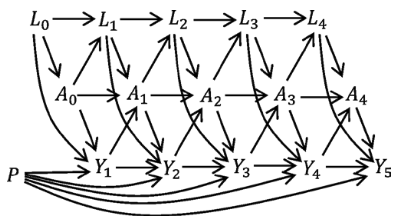

  
```{r, include = FALSE}
knitr::opts_chunk$set(
  collapse = TRUE,
  comment = "#>"
)
```
  
```{r setup}
library(ipeval)
library(survival)
```

This vignette demonstrates how to evaluate risk predictions under longitudinal treatment strategies in the presence of time-dependent confounding.

For more detail, read [Keogh and Van Geloven (2024)](https://doi.org/10.1097/EDE.0000000000001713), from which the methods in this package are implemented.

We assume that a validation dataset is available, together with risk predictions corresponding to one or more treatment strategies. Throughout this vignette, we use data generated from the causal structure shown below.



Suppose we have predicted risks under two intervention strategies:

* Never treated: treatment is set to 0 at every visit.
* Always treated: treatment is set to 1 at every visit.

In [the previous vignette](longitudinal-data-and-cox-models.html), we show how these predictions can be obtained from a marginal structural Cox model (and how such longitidunial data could be generated). Here, we focus on evaluating those predictions.

```{r, include=FALSE}

simulate_longitudinal_data <- function(n, n_visits = 5, visit_times = 0:4, seed) {
  set.seed(seed)
  
  L <- matrix(nrow = n, ncol = n_visits)
  A <- matrix(nrow = n, ncol = n_visits)
  P <- runif(n)
  time <- rep(NA, n)
  status <- rep(NA, n)
  
  for (i in 1:n_visits) {
    
    # simulate A, L, even if a patient already has had an event (and therefore
    # misses subsequent visits). These are set to NA later.
    
    L[, i] <- if (i == 1) {
      rnorm(n, 0, 1)
    } else {
      rnorm(n, 0.8 * L[, i - 1] - A[, i - 1] + 0.1 * (i-1))
    }
    
    A[, i] <- if (i == 1) {
      rbinom(n, 1, plogis(0.5 * L[, i]))
    } else {
      rbinom(n, 1, plogis(0.5 * L[, i] + 0.8 * A[, i - 1]))
    }
    
    # To simulate survival times with these time varying variables, we simulate a
    # survival time at the first visit, using the corresponding values of A and L
    # at that visit. If subject survived until after the next visit, we simulate
    # another survival time, this time using the new values of A and L, etc until
    # there is an event before the next visit. After the last visit, we just take
    # the last simulated survival time. 
    new_event_time <- rexp(n, exp(-2 + -0.5 * A[, i] + 0.5 * L[, i] + 0.5 * P))
    new_censor_time <- rexp(n, exp(-3))
    
    if (i != n_visits) {
      time_until_next_visit <- visit_times[i+1] - visit_times[i]
    } else {
      time_until_next_visit <- Inf
    }
    
    new_time <- pmin(new_event_time, new_censor_time)
    new_status <- new_event_time < new_censor_time
    
    # if there was an event before the next visit, use that, if not, time and
    # status are kept at NA and are given another chance next iteration
    status <- ifelse(
      is.na(status) & new_time < time_until_next_visit,
      new_status,
      status
    )
    time <- ifelse(
      is.na(time) & new_time < time_until_next_visit,
      visit_times[i] + new_time,
      time
    )
  }
  
  # wipe A and L values after events (no visit after event)
  for (i in 1:n_visits) {
    A[, i] <- ifelse(time < visit_times[i], rep(NA, n), A[, i])
    L[, i] <- ifelse(time < visit_times[i], rep(NA, n), L[, i])
  }
  
  colnames(A) <- paste0("A", 0:(n_visits - 1))
  colnames(L) <- paste0("L", 0:(n_visits - 1))
  
  data.frame(id = 1:n, time, status, A, L, P)
}

df_dev <- simulate_longitudinal_data(20000, seed = 2)
df_val <- simulate_longitudinal_data(50000, seed = 3)


df_dev_long <- wide_to_long(
    df_dev,
    baseline_variables = c("id", "time", "status", "L0", "P"),
    wide_variables = list(A = paste0("A", 0:4),
                          L = paste0("L", 0:4)),
    visit_times = 0:4,
    outcome_times = df_dev$time
)

# set the time intervals correctly. The start time of the interval is given by
# visit_time. For the interval end time, use the start of the next interval, or
# the survival time, whichever happens earlier. If there is no next interval
# (last visit), use the survival time.
df_dev_long$time_end <- ifelse(
  df_dev_long$visit_time == 4,
  df_dev_long$time,
  pmin(df_dev_long$visit_time + 1, df_dev_long$time)
)

df_dev_long$status <- ifelse(
  df_dev_long$time_end == df_dev_long$time,
  df_dev_long$status,
  0
)
df_dev_long$time <- NULL

df_dev_long <- add_lag_terms(df_dev_long, "A", 1:4)
df_dev_long <- df_dev_long[, c("id", "visit_time", "time_end", "status", "L0", "P",
                "L", "A", paste0("A_lag_", 1:4))]

iptw_model <- glm(A ~ L + A_lag_1, family = "binomial", data = df_dev_long)

iptw_propensity <- predict(iptw_model, type = "response")
iptw_prob_trt <- ifelse(
    df_dev_long$A == 1,
    iptw_propensity,
    1 - iptw_propensity
  )
df_dev_long$iptw <- 1 / iptw_prob_trt
df_dev_long$iptw_cumprod <- ave(df_dev_long$iptw, df_dev_long$id, FUN = cumprod)
  
cox_msm <- coxph(
  formula = Surv(visit_time, time_end, status) ~ A + A_lag_1 + A_lag_2 + A_lag_3 + A_lag_4 + L0 + P,
  data = df_dev_long,
  weights = iptw_cumprod,
  model = TRUE
)

compute_msm_probabilities <- function(model, data, treatment) {
  
  # get cumulative hazard fct from model
  bh <- survival::basehaz(model, centered = FALSE)
  cumhaz.fun <- stats::stepfun(bh$time, c(0, bh$hazard))
  
  # extract baseline covariates from data
  pred_under_int <- data[, c("id", "L0", "P")]
  
  # create a row for each visit
  pred_under_int <- pred_under_int[rep(1:nrow(data), rep(5, nrow(data))), ]
  pred_under_int$visit_time <- rep(0:4, nrow(data))
  pred_under_int$end_time <- pred_under_int$visit_time + 1

  pred_under_int$A <- treatment
  pred_under_int <- add_lag_terms(pred_under_int, "A", lag = 1:4)
  
  # compute the cumulative hazard contribution between each visit
  pred_under_int <- within(pred_under_int, {
    cumhaz_start <- cumhaz.fun(visit_time)
    cumhaz_end <- cumhaz.fun(end_time)
    lp <- predict(model, newdata = pred_under_int, type = "lp")
    contribution <- (cumhaz_end - cumhaz_start) * exp(lp)
  })
  
  # take the sum
  cumhaz <- tapply(pred_under_int$contribution, pred_under_int$id, FUN = sum)
  1 - exp(-cumhaz)
}

risk_under_0 <- compute_msm_probabilities(cox_msm, df_val, 0)
risk_under_1 <- compute_msm_probabilities(cox_msm, df_val, 1)
```

```{r}
head(df_val)
summary(risk_under_0)
summary(risk_under_1)
```

We will use the `ip_score_long()` function, which evaluates risk predictions under longitudinal interventions using inverse-probability weighting. It requires:
- an outcome dataset with one row per subject, with survival time and status,
- a longitudinal dataset with one row per subject and visit,
- a model describing the treatment assignment mechanism.

The longitudinal dataset must contain all variables used in the treatment model. In our example, treatment depends on the current confounder value L and the previous treatment value, so the variables L, A, and A_lag_1 are required.

This package provides some convenience functions to reshape your data in this way.

```{r}
df_val_outcome <- df_val[, c("id", "time", "status")]
df_val_long <- wide_to_long(df_val, baseline_variables = c("id"), 
                            wide_variables = list("A" = paste0("A", 0:4),
                                                  "L" = paste0("L", 0:4)),
                            visit_times = 0:4, outcome_times = df_val$time)
df_val_long <- add_lag_terms(df_val_long, "A")
head(df_val_long)
```

Assuming independent censoring, we can evaluate the predictions under the never-treated strategy as follows:

```{r}
ip_score_long(
  probabilities = risk_under_0,
  data_outcome = df_val_outcome,
  data_long = df_val_long,
  treatment_formula = A ~ A_lag_1 + L,
  treatment_of_interest = "never",
  visit_times = 0:4, 
  time_horizon = 5
)
```

The same procedure can be used for the always-treated strategy:

```{r}
ip_score_long(
  probabilities = risk_under_1,
  data_outcome = df_val_outcome,
  data_long = df_val_long,
  treatment_formula = A ~ A_lag_1 + L,
  treatment_of_interest = "always",
  visit_times = 0:4, 
  time_horizon = 5
)
```

# Arbitrary treatment patterns

The treatment strategy does not need to be "always" or "never" treated. For example, the following strategy specifies treatment at the first two visits and leaves subsequent treatment unconstrained:

```{r}
ip_score_long(
  probabilities = risk_under_0,
  data_outcome = df_val_outcome,
  data_long = df_val_long,
  treatment_formula = A ~ A_lag_1 + L,
  treatment_of_interest = c(0, 0, NA, NA, NA),
  visit_times = 0:4, 
  time_horizon = 5,
  metrics = c("auc", "brier", "oeratio")
)
```

# Censoring dependent on time varying variables

In the previous examples, we did not specify the censoring mechanism. By default, this is done with Kaplan-Meier. It is also possible to specify a Cox censoring model with time varying variables. These variables should then be available as columns in ```data_long```. As a demonstration, this can be achieved as follows:

```{r}
ip_score_long(
  probabilities = risk_under_1,
  data_outcome = df_val_outcome,
  data_long = df_val_long,
  treatment_formula = A ~ A_lag_1 + L,
  treatment_of_interest = c(1, 1, 1, 1, 1),
  visit_times = 0:4, 
  time_horizon = 5,
  cens_model = "cox",
  cens_formula = ~ A + A_lag_1 + L,
  metrics = c("auc", "brier", "oeratio")
)
```

Note that the coefficients of the IPC model are close to 0. This is expected as we simulated independent censoring.

